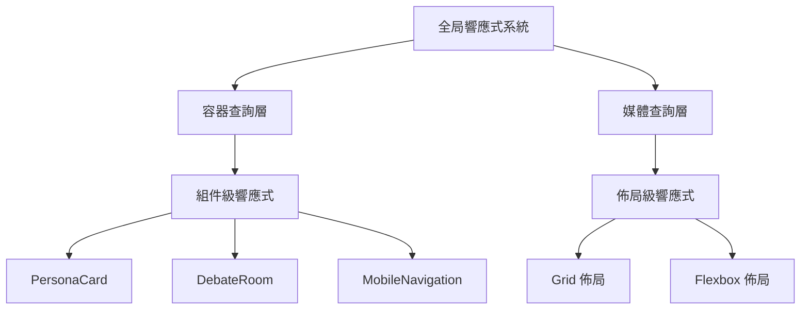
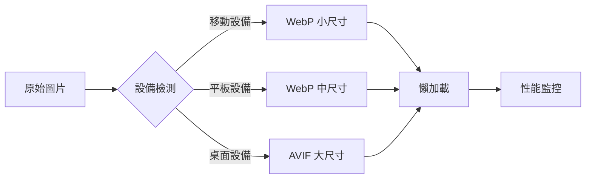

# 自適應響應型物件設計文檔

## 概述

本設計文檔詳細說明了虛擬會議室項目中自適應響應型物件設計系統的技術實現方案。該系統將利用現代 CSS 技術，包括容器查詢、流體排版、CSS Grid/Flexbox 高級佈局等，創建一個真正適應性強的用戶界面。

## 系統架構

### 響應式設計層次結構



### 技術棧整合

- **Next.js 16**: 利用最新的 Image 組件和性能優化
- **TailwindCSS 4**: 使用新的容器查詢支持和改進的響應式工具
- **CSS 自定義屬性**: 實現動態主題和響應式變量
- **Web Vitals 監控**: 集成性能監控和優化

## 核心設計模式

### 1. 容器查詢響應式系統

#### 實現策略

```css
/* 容器查詢基礎設置 */
.component-container {
  container-type: inline-size;
  container-name: component;
}

/* PersonaCard 容器查詢 */
.persona-card {
  /* 窄容器佈局 */
  display: flex;
  flex-direction: column;
  
  @container component (min-width: 300px) {
    /* 中等容器佈局 */
    flex-direction: row;
    align-items: center;
  }
  
  @container component (min-width: 500px) {
    /* 寬容器佈局 */
    display: grid;
    grid-template-columns: auto 1fr auto;
    gap: 1rem;
  }
}
```

#### 組件適配矩陣

| 容器寬度 | PersonaCard 佈局 | DebateRoom 佈局 | Navigation 佈局 |
|---------|-----------------|----------------|----------------|
| < 300px | 垂直堆疊 | 單列 | 漢堡菜單 |
| 300-500px | 水平排列 | 雙列 | 底部標籤 |
| > 500px | 網格佈局 | 三列 | 側邊欄 |

### 2. 流體排版系統

#### 排版比例計算

使用數學函數計算流體排版參數：

```
v = (100 * (y2 - y1)) / (x2 - x1)
r = (x1 * y2 - x2 * y1) / (x1 - x2)
```

其中：
- v: viewport 寬度值 (vw)
- r: 相對大小值 (rem)
- x1, x2: 起始和結束視窗寬度
- y1, y2: 起始和結束字體大小

#### 實際應用

```css
/* 主標題流體排版 */
.heading-primary {
  font-size: clamp(1.5rem, 2vw + 1rem, 3rem);
  line-height: clamp(1.2, 1vw + 1.1, 1.4);
}

/* 正文流體排版 */
.body-text {
  font-size: clamp(0.875rem, 1vw + 0.5rem, 1.125rem);
  line-height: clamp(1.4, 0.5vw + 1.3, 1.6);
}
```

### 3. 自適應圖片系統

#### Next.js Image 組件優化

```tsx
// 響應式圖片組件
const ResponsiveImage: React.FC<ResponsiveImageProps> = ({
  src,
  alt,
  priority = false,
  className
}) => {
  return (
    <Image
      src={src}
      alt={alt}
      fill
      priority={priority}
      sizes="(max-width: 640px) 100vw, (max-width: 1024px) 50vw, 33vw"
      className={`object-cover ${className}`}
      quality={75}
      placeholder="blur"
      blurDataURL="data:image/jpeg;base64,..."
    />
  );
};
```

#### 圖片優化策略



### 4. 高級佈局系統

#### Grid + Flexbox 混合佈局

```css
/* 主佈局 Grid */
.main-layout {
  display: grid;
  grid-template-areas:
    "header header header"
    "sidebar main aside"
    "footer footer footer";
  grid-template-columns: 250px 1fr 200px;
  grid-template-rows: auto 1fr auto;
  min-height: 100vh;
  gap: 1rem;
}

/* 內容區域 Flexbox */
.content-area {
  grid-area: main;
  display: flex;
  flex-direction: column;
  gap: 1rem;
}

/* 響應式調整 */
@media (max-width: 1024px) {
  .main-layout {
    grid-template-areas:
      "header"
      "main"
      "footer";
    grid-template-columns: 1fr;
  }
}
```

#### 自適應網格系統

```css
/* 自適應卡片網格 */
.card-grid {
  display: grid;
  grid-template-columns: repeat(auto-fit, minmax(280px, 1fr));
  gap: clamp(1rem, 2vw, 2rem);
  padding: clamp(1rem, 3vw, 3rem);
}

/* 容器查詢優化 */
@container (min-width: 600px) {
  .card-grid {
    grid-template-columns: repeat(auto-fit, minmax(320px, 1fr));
  }
}
```

## 組件設計規範

### PersonaCard 響應式重構

```tsx
const PersonaCard: React.FC<PersonaCardProps> = ({ persona, ...props }) => {
  return (
    <div className="persona-card-container" style={{ containerType: 'inline-size' }}>
      <div className="persona-card">
        {/* 頭像區域 - 容器查詢響應式 */}
        <div className="avatar-section">
          <ResponsiveImage
            src={persona.avatar}
            alt={persona.name}
            className="avatar"
          />
        </div>
        
        {/* 信息區域 - 流體排版 */}
        <div className="info-section">
          <h3 className="persona-name">{persona.name}</h3>
          <p className="persona-role">{persona.role}</p>
        </div>
        
        {/* 控制區域 - 觸摸優化 */}
        <div className="controls-section">
          {/* 觸摸友好按鈕 */}
        </div>
      </div>
    </div>
  );
};
```

### MobileNavigation 手勢增強

```tsx
const MobileNavigation: React.FC<MobileNavigationProps> = ({ ...props }) => {
  const swipeHandlers = useSwipe({
    onSwipeLeft: () => setDrawerOpen(false),
    onSwipeRight: () => setDrawerOpen(true),
  }, {
    threshold: 50,
    preventDefaultTouchmoveEvent: true
  });

  return (
    <div className="mobile-nav-container">
      {/* 手勢感應區域 */}
      <div className="swipe-area" {...swipeHandlers}>
        {/* 導航內容 */}
      </div>
    </div>
  );
};
```

## 性能優化策略

### Web Vitals 監控實現

```typescript
// Web Vitals 監控服務
class WebVitalsMonitor {
  private metrics: Map<string, number> = new Map();
  
  constructor() {
    this.initializeMonitoring();
  }
  
  private initializeMonitoring() {
    // LCP 監控
    new PerformanceObserver((list) => {
      const entries = list.getEntries();
      const lastEntry = entries[entries.length - 1];
      this.metrics.set('LCP', lastEntry.startTime);
      this.reportMetric('LCP', lastEntry.startTime);
    }).observe({ entryTypes: ['largest-contentful-paint'] });
    
    // INP 監控
    new PerformanceObserver((list) => {
      for (const entry of list.getEntries()) {
        this.metrics.set('INP', entry.processingStart - entry.startTime);
        this.reportMetric('INP', entry.processingStart - entry.startTime);
      }
    }).observe({ entryTypes: ['event'] });
    
    // CLS 監控
    new PerformanceObserver((list) => {
      let clsValue = 0;
      for (const entry of list.getEntries()) {
        if (!entry.hadRecentInput) {
          clsValue += entry.value;
        }
      }
      this.metrics.set('CLS', clsValue);
      this.reportMetric('CLS', clsValue);
    }).observe({ entryTypes: ['layout-shift'] });
  }
  
  private reportMetric(name: string, value: number) {
    // 發送到分析服務
    analytics.track('web_vital', { metric: name, value });
    
    // 性能警告
    if (this.isMetricPoor(name, value)) {
      console.warn(`Poor ${name} performance: ${value}`);
    }
  }
  
  private isMetricPoor(metric: string, value: number): boolean {
    const thresholds = {
      LCP: 2500,  // 2.5s
      INP: 200,   // 200ms
      CLS: 0.1    // 0.1
    };
    return value > thresholds[metric as keyof typeof thresholds];
  }
}
```

### 代碼分割和懶加載

```typescript
// 組件懶加載
const PersonaManager = lazy(() => import('@/components/PersonaManager'));
const DebateRoom = lazy(() => import('@/components/DebateRoom'));

// 路由級代碼分割
const PersonasPage = lazy(() => import('@/app/personas/page'));

// 動態導入工具函數
const loadUtils = () => import('@/utils/advanced-utils');
```

## 測試策略

### 響應式測試矩陣

| 設備類型 | 屏幕尺寸 | 測試重點 | 工具 |
|---------|---------|---------|------|
| 手機 | 320-480px | 觸摸交互、性能 | Chrome DevTools |
| 平板 | 768-1024px | 佈局轉換、手勢 | BrowserStack |
| 桌面 | 1280px+ | 複雜佈局、功能完整性 | Playwright |

### 自動化測試實現

```typescript
// 響應式視覺回歸測試
describe('Responsive Design Tests', () => {
  const viewports = [
    { width: 320, height: 568, name: 'mobile' },
    { width: 768, height: 1024, name: 'tablet' },
    { width: 1920, height: 1080, name: 'desktop' }
  ];
  
  viewports.forEach(viewport => {
    test(`PersonaCard layout at ${viewport.name}`, async ({ page }) => {
      await page.setViewportSize(viewport);
      await page.goto('/personas');
      
      // 等待容器查詢生效
      await page.waitForTimeout(100);
      
      // 截圖比較
      await expect(page.locator('.persona-card')).toHaveScreenshot(
        `persona-card-${viewport.name}.png`
      );
    });
  });
});
```

## 邊界情況和特殊處理

### 容器查詢降級策略

```css
/* 不支持容器查詢的瀏覽器降級 */
.persona-card {
  /* 默認移動佈局 */
  display: flex;
  flex-direction: column;
}

/* 媒體查詢降級 */
@media (min-width: 640px) {
  .persona-card {
    flex-direction: row;
  }
}

/* 容器查詢增強 */
@supports (container-type: inline-size) {
  .persona-card-container {
    container-type: inline-size;
  }
  
  @container (min-width: 300px) {
    .persona-card {
      flex-direction: row;
    }
  }
}
```

### 性能降級處理

| 條件 | 降級策略 | 實現方式 |
|------|---------|---------|
| 低端設備 | 禁用動畫 | `prefers-reduced-motion` |
| 慢網絡 | 簡化佈局 | Network Information API |
| 舊瀏覽器 | 媒體查詢降級 | `@supports` 檢測 |

這個設計文檔提供了完整的技術實現方案，確保自適應響應型物件設計系統能夠在各種設備和條件下提供最佳的用戶體驗。