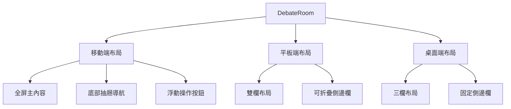
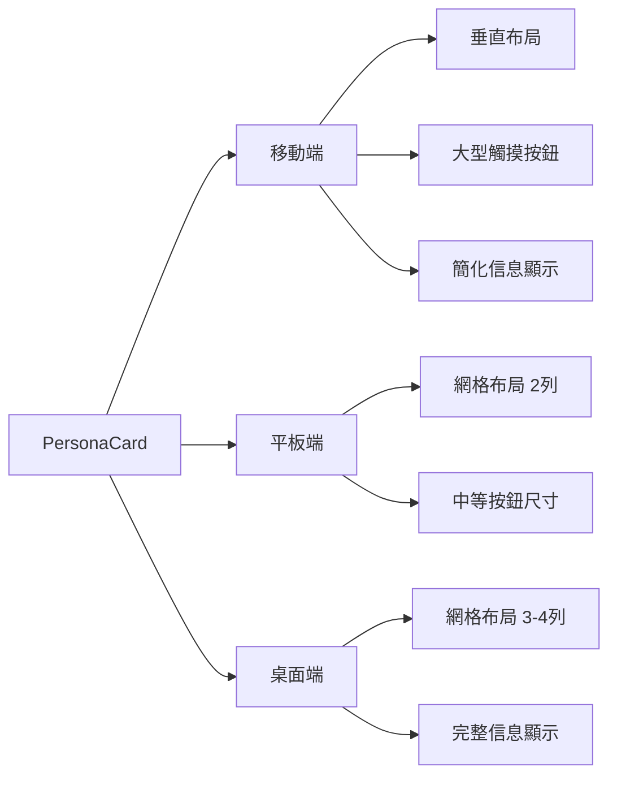
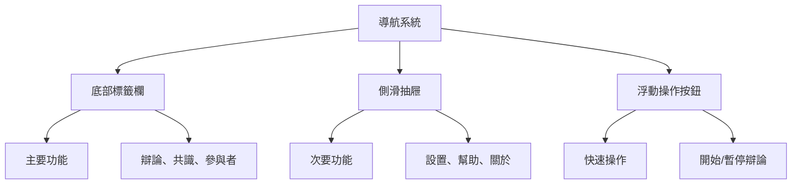

# 響應式移動端優化設計文檔

## 介紹

本設計文檔基於需求分析，提供了全面的響應式移動端優化解決方案。我們將採用移動優先的設計方法，使用TailwindCSS的響應式功能，並實現現代化的移動端交互模式，同時解決現有的狀態管理和功能性問題。

## 技術架構

### 響應式斷點策略

基於研究結果，我們將採用語義化的斷點命名方式，而非傳統的尺寸命名： <kreference link="https://mrtnschndlr.medium.com/things-to-rethink-with-tailwind-css-part-1-breakpoints-b2809e2bbb2" index="3">[^3]</kreference>

```javascript
// tailwind.config.js
module.exports = {
  theme: {
    screens: {
      'mobile': '320px',    // 小型手機
      'tablet': '640px',    // 平板和大型手機
      'laptop': '1024px',   // 筆記本電腦
      'desktop': '1280px',  // 桌面顯示器
    },
  }
}
```

### 移動優先設計原則

1. **基礎樣式**：所有未加前綴的類別適用於移動設備
2. **漸進增強**：使用 `tablet:`, `laptop:`, `desktop:` 前綴逐步增強
3. **觸摸友好**：最小觸摸目標44px×44px <kreference link="https://www.uxpin.com/studio/blog/tailwind-best-practices/" index="2">[^2]</kreference>
4. **內容優先**：確保核心功能在小屏幕上可用

## 組件設計規範

### 1. DebateRoom 主容器

#### 當前問題
- 固定寬度的側邊欄在移動設備上佔用過多空間
- 標籤導航在小屏幕上擁擠
- 控制面板無法在移動設備上有效使用

#### 解決方案



#### 實現細節

**移動端 (320px-640px)**
- 主內容區域佔滿整個屏幕
- 標籤導航轉換為底部抽屜
- 控制面板作為浮動操作按鈕(FAB)
- 使用手勢滑動切換標籤

**平板端 (640px-1024px)**
- 雙欄布局：主內容 + 可折疊側邊欄
- 標籤導航保持在頂部但優化間距
- 控制面板集成到側邊欄

**桌面端 (1024px+)**
- 保持現有三欄布局
- 優化間距和字體大小

### 2. PersonaCard 響應式設計

#### 當前問題
- 固定寬度導致在小屏幕上溢出
- 按鈕過小，不適合觸摸操作
- 信息密度過高，在移動設備上難以閱讀

#### 解決方案



#### 實現規範

**移動端優化**
- 卡片寬度：100%（單列）
- 最小高度：120px
- 按鈕尺寸：44px×44px
- 字體大小：16px（主要文字）、14px（次要文字）
- 間距：16px（外邊距）、12px（內邊距）

**觸摸交互優化**
- 增加點擊區域
- 添加觸摸反饋動畫
- 優化滑動手勢支持

### 3. DebateControlPanel 移動端適配

#### 當前問題
- 按鈕網格在小屏幕上過於擁擠
- 文字輸入框在移動設備上難以使用
- 狀態指示器不夠明顯

#### 解決方案

**移動端布局**
- 按鈕改為單列垂直排列
- 增大按鈕高度至56px
- 優化文字輸入框的觸摸體驗
- 添加視覺狀態指示器

**交互優化**
- 支持滑動手勢操作
- 添加觸覺反饋
- 優化鍵盤彈出時的布局調整

### 4. 導航系統重設計

基於移動端導航模式研究，我們將實現混合導航系統： <kreference link="https://www.uxpin.com/studio/blog/mobile-navigation-patterns-pros-and-cons/" index="4">[^4]</kreference>

#### 移動端導航模式



#### 實現策略

**底部標籤欄**
- 3-4個主要功能標籤
- 圖標 + 文字標籤
- 高度：72px
- 支持滑動切換

**側滑抽屜**
- 從左側滑出
- 包含次要功能和設置
- 支持手勢關閉
- 半透明背景遮罩

## 狀態管理優化

### Zustand 遷移問題解決

基於研究發現的Zustand狀態遷移問題，我們需要實現以下修復： <kreference link="https://github.com/pmndrs/zustand/discussions/2663" index="5">[^5]</kreference>

#### 問題分析
- "State loaded from storage couldn't be migrated" 警告
- 缺少遷移函數導致的狀態恢復問題
- 移動端狀態同步異常

#### 解決方案

```typescript
// 添加狀態版本控制和遷移函數
const useMeetingRoomStore = create<MeetingRoomState>()(
  persist(
    (set, get) => ({
      // ... 現有狀態
    }),
    {
      name: 'meeting-room-storage',
      version: 1,
      migrate: (persistedState: any, version: number) => {
        if (version === 0) {
          // 從版本0遷移到版本1
          return {
            ...persistedState,
            // 添加新的默認值
            debateSettings: {
              timeoutPerRound: 300000, // 5分鐘，確保不少於30秒
              ...persistedState.debateSettings
            }
          };
        }
        return persistedState;
      },
      partialize: (state) => ({
        rooms: state.rooms,
        availablePersonas: state.availablePersonas,
      }),
    }
  )
);
```

### 辯論初始化錯誤修復

#### 問題分析
- "每回合超時時間不能少於30秒" 錯誤
- "辯論尚未準備就緒" 狀態問題
- 移動端觸摸操作導致的狀態異常

#### 解決方案

```typescript
// 優化驗證邏輯
private validateRoomSettings(room: MeetingRoom): void {
  // 確保超時時間至少30秒（30000毫秒）
  const minTimeout = 30000;
  if (room.settings.timeoutPerRound && room.settings.timeoutPerRound < minTimeout) {
    // 自動修正而非拋出錯誤
    room.settings.timeoutPerRound = minTimeout;
    console.warn(`超時時間已自動調整為${minTimeout/1000}秒`);
  }
  
  // 其他驗證邏輯...
}
```

## 性能優化策略

### 1. 代碼分割和懶加載

```typescript
// 組件懶加載
const DebateRoom = lazy(() => import('./components/DebateRoom'));
const PersonaManager = lazy(() => import('./components/PersonaManager'));

// 路由級別的代碼分割
const PersonasPage = lazy(() => import('./app/personas/page'));
```

### 2. 圖片和資源優化

```typescript
// 響應式圖片
<Image
  src="/persona-avatar.jpg"
  alt="Persona Avatar"
  width={48}
  height={48}
  sizes="(max-width: 640px) 48px, (max-width: 1024px) 64px, 80px"
  className="rounded-full"
/>
```

### 3. 虛擬化長列表

```typescript
// 對於大量PersonaCard的情況
import { FixedSizeList as List } from 'react-window';

const VirtualizedPersonaList = ({ personas }) => (
  <List
    height={400}
    itemCount={personas.length}
    itemSize={120}
    className="mobile:h-screen tablet:h-96"
  >
    {({ index, style }) => (
      <div style={style}>
        <PersonaCard persona={personas[index]} />
      </div>
    )}
  </List>
);
```

## 測試策略

### 1. 響應式測試

```typescript
// 使用React Testing Library進行響應式測試
describe('DebateRoom Responsive', () => {
  test('mobile layout', () => {
    Object.defineProperty(window, 'innerWidth', {
      writable: true,
      configurable: true,
      value: 375,
    });
    
    render(<DebateRoom />);
    expect(screen.getByTestId('mobile-navigation')).toBeInTheDocument();
  });
});
```

### 2. 觸摸交互測試

```typescript
// 觸摸事件測試
test('persona card touch interactions', () => {
  render(<PersonaCard />);
  const card = screen.getByRole('button');
  
  fireEvent.touchStart(card);
  fireEvent.touchEnd(card);
  
  expect(mockOnToggle).toHaveBeenCalled();
});
```

### 3. 性能測試

```typescript
// 使用Web Vitals監控
import { getCLS, getFID, getFCP, getLCP, getTTFB } from 'web-vitals';

function sendToAnalytics(metric) {
  // 發送性能指標到分析服務
}

getCLS(sendToAnalytics);
getFID(sendToAnalytics);
getFCP(sendToAnalytics);
getLCP(sendToAnalytics);
getTTFB(sendToAnalytics);
```

## 實現時間線

### 階段1：基礎響應式框架（1-2週）
- 設置TailwindCSS自定義斷點
- 實現基礎移動端布局
- 修復狀態管理問題

### 階段2：組件優化（2-3週）
- PersonaCard響應式重構
- DebateControlPanel移動端適配
- 導航系統重設計

### 階段3：交互優化（1-2週）
- 觸摸手勢支持
- 動畫和過渡效果
- 性能優化

### 階段4：測試和調優（1週）
- 跨設備測試
- 性能監控
- 用戶體驗調優

## 參考資料

[^1]: https://chenhuijing.com/blog/the-horizontal-overflow-problem/
[^2]: https://www.uxpin.com/studio/blog/tailwind-best-practices/
[^3]: https://mrtnschndlr.medium.com/things-to-rethink-with-tailwind-css-part-1-breakpoints-b2809e2bbb2
[^4]: https://www.uxpin.com/studio/blog/mobile-navigation-patterns-pros-and-cons/
[^5]: https://github.com/pmndrs/zustand/discussions/2663