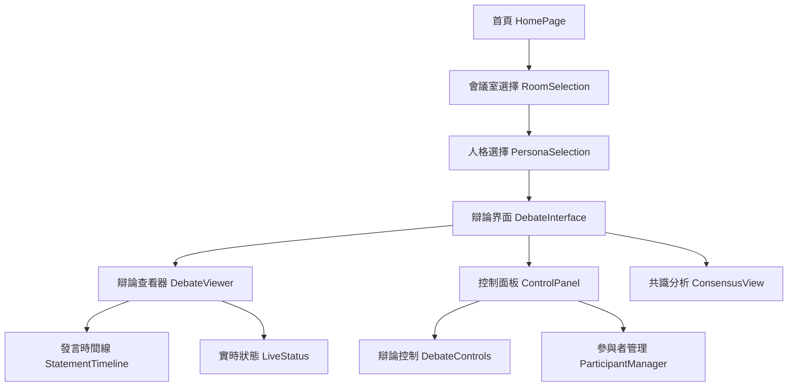
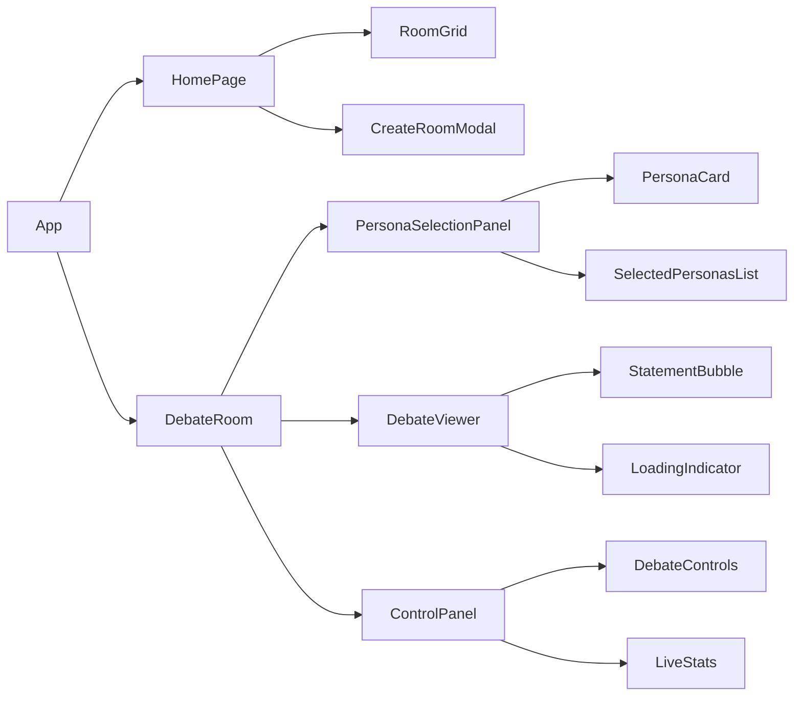
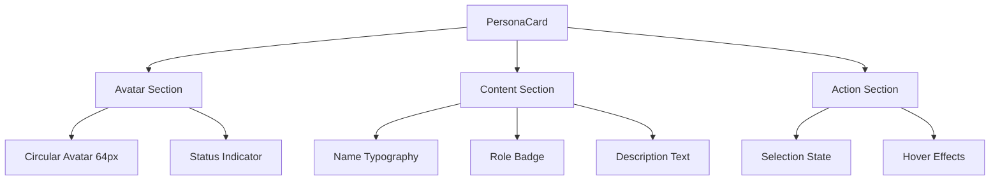
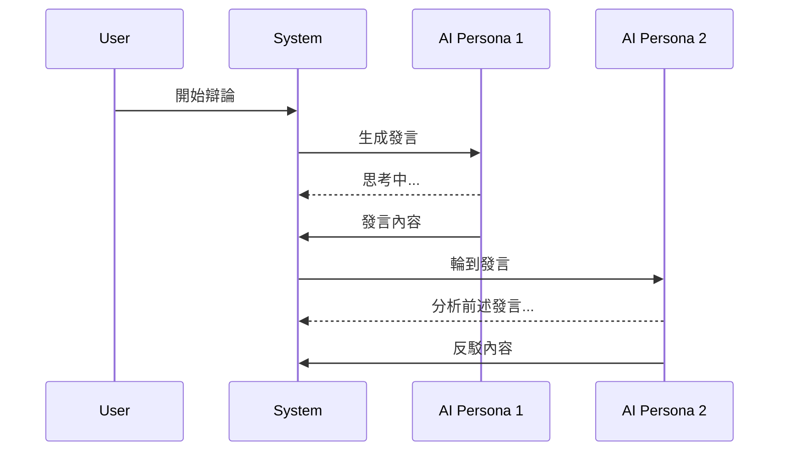
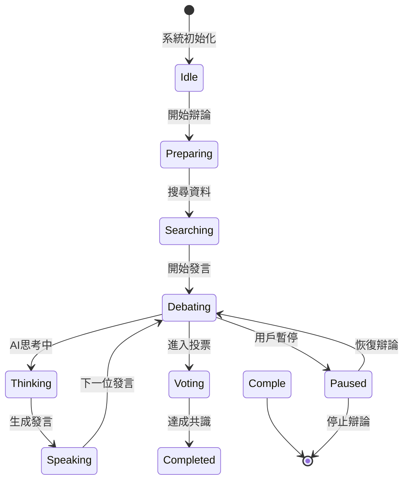
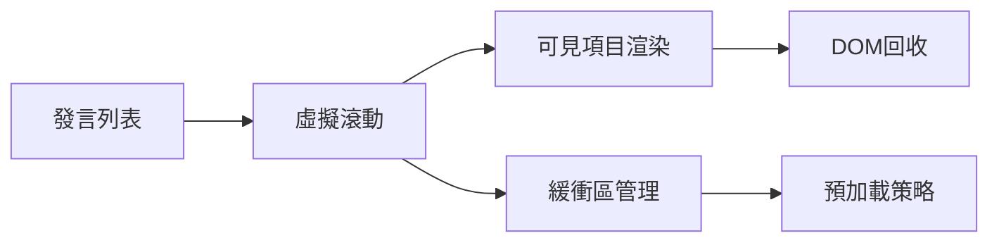
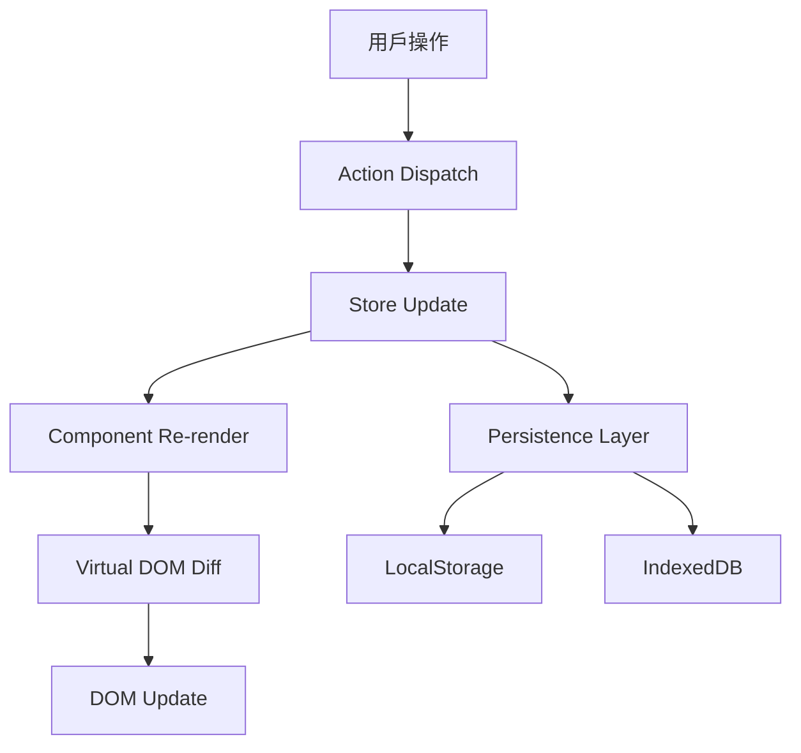

# 虛擬會議室UI體驗優化設計文檔

## 簡介

本設計文檔基於需求分析和現代UI設計最佳實踐，為虛擬會議室系統提供全面的界面設計方案。重點關注人格選擇體驗、辯論可視化和響應式設計，以創建直觀且高效的用戶界面。

## 整體架構設計

### 系統架構概覽



### 組件層次結構



## 核心組件設計

### 1. PersonaSelectionPanel 組件

#### 設計原則
- **卡片式布局**：採用Material Design卡片模式，提供清晰的視覺分組 <kreference link="https://www.nngroup.com/articles/cards-component/" index="1">[^1]</kreference>
- **響應式網格**：使用CSS Grid實現自適應布局 <kreference link="https://medium.com/@abdulsamad18090/responsive-web-design-best-practices-for-2024-492a42635a4c" index="2">[^2]</kreference>
- **觸摸友好**：確保最小44px×44px的觸摸區域 <kreference link="https://medium.com/@abdulsamad18090/responsive-web-design-best-practices-for-2024-492a42635a4c" index="2">[^2]</kreference>

#### 視覺設計規範



#### 響應式斷點設計
- **Desktop (≥1024px)**: 3列網格，卡片寬度320px
- **Tablet (768px-1023px)**: 2列網格，卡片寬度自適應
- **Mobile (<768px)**: 1列堆疊，卡片寬度100%

### 2. DebateViewer 組件重設計

#### 時間線布局設計



#### 發言氣泡設計規範
- **左右交替布局**：奇數回合靠左，偶數回合靠右
- **漸進式展示**：支持摺疊/展開詳細信息
- **視覺層次**：使用陰影和間距創建深度感

### 3. 實時狀態系統設計

#### 狀態指示器架構



## 視覺設計系統

### 色彩系統

#### 主色調配置
- **Primary**: #3B82F6 (藍色) - 主要操作按鈕
- **Secondary**: #10B981 (綠色) - 成功狀態
- **Warning**: #F59E0B (橙色) - 警告信息
- **Error**: #EF4444 (紅色) - 錯誤狀態
- **Neutral**: #6B7280 (灰色) - 次要文字

#### 人格專屬色彩
- **CEO**: #1F2937 (深灰) - 權威感
- **CTO**: #059669 (深綠) - 技術感
- **CFO**: #DC2626 (紅色) - 財務警覺
- **環保倡議者**: #16A34A (綠色) - 環保理念
- **法律顧問**: #7C3AED (紫色) - 專業嚴謹
- **市場分析師**: #EA580C (橙色) - 活力創新

### 字體系統

#### 字體層次
- **H1**: 32px/40px, font-weight: 700 - 頁面標題
- **H2**: 24px/32px, font-weight: 600 - 區塊標題
- **H3**: 20px/28px, font-weight: 600 - 組件標題
- **Body**: 16px/24px, font-weight: 400 - 正文內容
- **Caption**: 14px/20px, font-weight: 400 - 輔助信息
- **Small**: 12px/16px, font-weight: 400 - 標籤文字

### 間距系統

#### 標準間距單位
- **xs**: 4px - 元素內部間距
- **sm**: 8px - 相關元素間距
- **md**: 16px - 組件間距
- **lg**: 24px - 區塊間距
- **xl**: 32px - 頁面區域間距
- **2xl**: 48px - 主要區域間距

## 交互設計規範

### 動畫設計原則

#### 過渡動畫配置
- **Duration**: 200ms (快速反饋), 300ms (標準), 500ms (複雜動畫)
- **Easing**: ease-out (進入), ease-in (退出), ease-in-out (變換)
- **Transform**: 優先使用transform和opacity，避免觸發重排

#### 關鍵動畫場景
1. **卡片選擇**: scale(1.02) + shadow增強
2. **發言出現**: slideInUp + fadeIn
3. **狀態切換**: crossfade
4. **加載狀態**: pulse + rotate

### 觸摸交互設計

#### 手勢支持
- **點擊**: 選擇/取消選擇人格
- **長按**: 顯示詳細信息
- **滑動**: 在移動端切換標籤
- **雙擊**: 快速操作（如收藏）

## 響應式設計策略

### 斷點系統

```css
/* 移動優先設計 */
.container {
  /* Mobile: 320px+ */
  padding: 16px;
  
  /* Tablet: 768px+ */
  @media (min-width: 768px) {
    padding: 24px;
  }
  
  /* Desktop: 1024px+ */
  @media (min-width: 1024px) {
    padding: 32px;
  }
  
  /* Large Desktop: 1280px+ */
  @media (min-width: 1280px) {
    padding: 48px;
  }
}
```

### 組件適配策略

#### PersonaCard 響應式行為
- **Mobile**: 全寬卡片，垂直堆疊信息
- **Tablet**: 2列網格，保持卡片比例
- **Desktop**: 3列網格，增加懸停效果

#### DebateViewer 適配
- **Mobile**: 單列時間線，簡化發言氣泡
- **Tablet**: 保持時間線，增加側邊信息
- **Desktop**: 完整布局，支持多面板視圖

## 性能優化設計

### 虛擬化策略

#### 長列表優化


#### 圖片優化
- **懶加載**: 使用Intersection Observer
- **響應式圖片**: srcset + sizes屬性
- **格式優化**: WebP優先，JPEG降級

### 狀態管理優化

#### 數據流設計


## 無障礙設計規範

### ARIA 標籤策略

#### 語義化標記
- **role**: 定義組件角色
- **aria-label**: 提供描述性標籤
- **aria-describedby**: 關聯詳細描述
- **aria-expanded**: 指示展開狀態

#### 鍵盤導航支持
- **Tab順序**: 邏輯性導航路徑
- **Enter/Space**: 激活操作
- **Escape**: 關閉模態/取消操作
- **Arrow Keys**: 在組件間導航

### 對比度標準

#### WCAG AA 合規性
- **正文文字**: 4.5:1 最小對比度
- **大文字**: 3:1 最小對比度
- **非文字元素**: 3:1 最小對比度
- **焦點指示器**: 清晰可見的焦點環

## 邊界情況處理

### 錯誤狀態設計

| 場景 | 視覺表現 | 用戶操作 | 系統行為 |
|------|----------|----------|----------|
| 網絡連接失敗 | 頂部警告條 | 重試按鈕 | 自動重連 |
| API調用超時 | 加載失敗提示 | 手動重試 | 指數退避 |
| 人格選擇上限 | 卡片禁用 | 移除其他人格 | 動態更新 |
| 辯論中斷 | 暫停狀態 | 恢復/停止 | 保存進度 |

### 空狀態設計

#### 會議室列表為空
- **視覺**: 插圖 + 引導文字
- **操作**: 突出的創建按鈕
- **文案**: 友好且具有指導性

#### 辯論歷史為空
- **視覺**: 簡潔的佔位符
- **操作**: 開始辯論按鈕
- **文案**: 鼓勵性的提示

## 技術實現考量

### 組件庫選擇
- **基礎組件**: Headless UI + Tailwind CSS
- **圖標系統**: Lucide React
- **動畫庫**: Framer Motion
- **圖表庫**: Recharts

### 狀態管理
- **全局狀態**: Zustand (已使用)
- **服務器狀態**: TanStack Query
- **表單狀態**: React Hook Form

### 測試策略
- **單元測試**: Jest + Testing Library
- **視覺回歸**: Chromatic
- **E2E測試**: Playwright
- **無障礙測試**: axe-core

## 參考資料

[^1]: https://www.nngroup.com/articles/cards-component/
[^2]: https://medium.com/@abdulsamad18090/responsive-web-design-best-practices-for-2024-492a42635a4c
[^3]: https://www.eleken.co/blog-posts/card-ui-examples-and-best-practices-for-product-owners
[^4]: https://www.eleken.co/blog-posts/bad-ux-examples