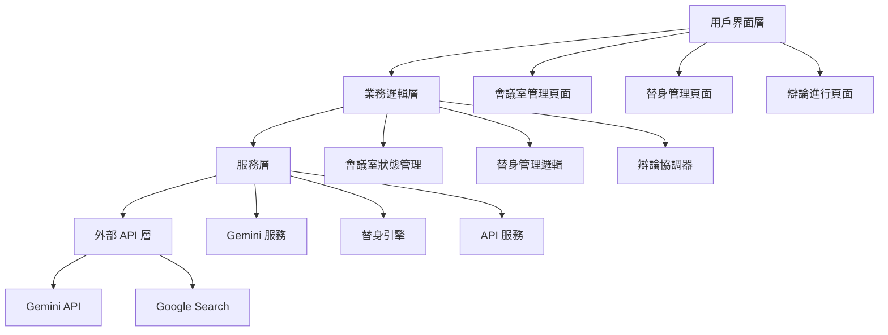
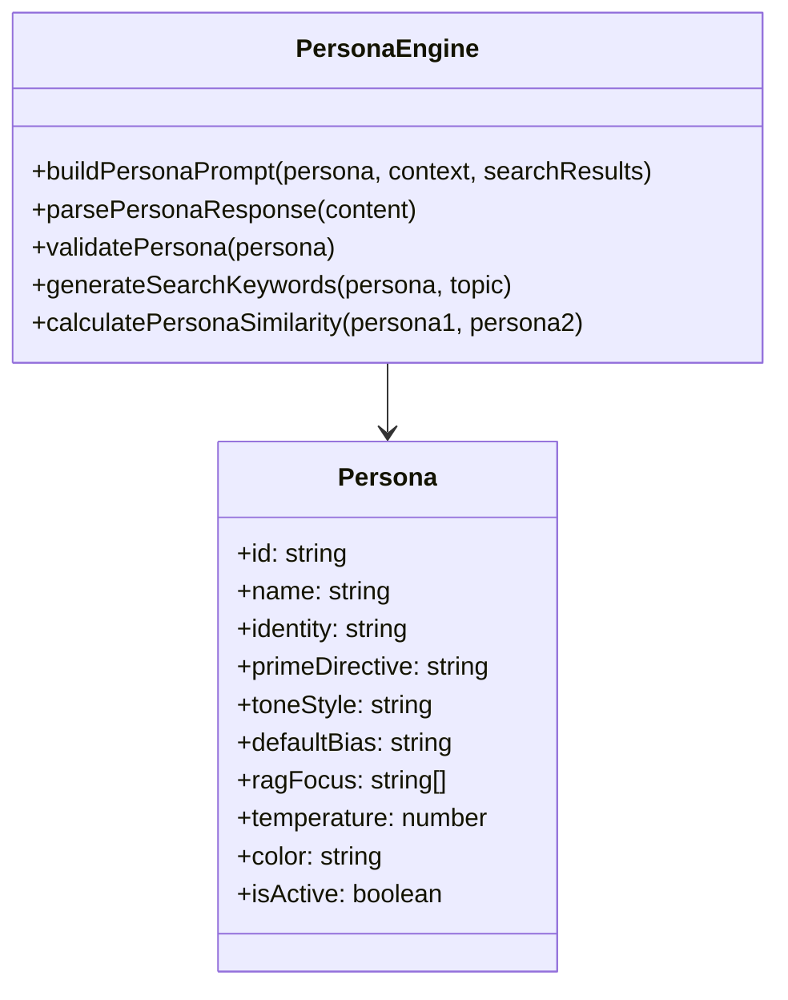
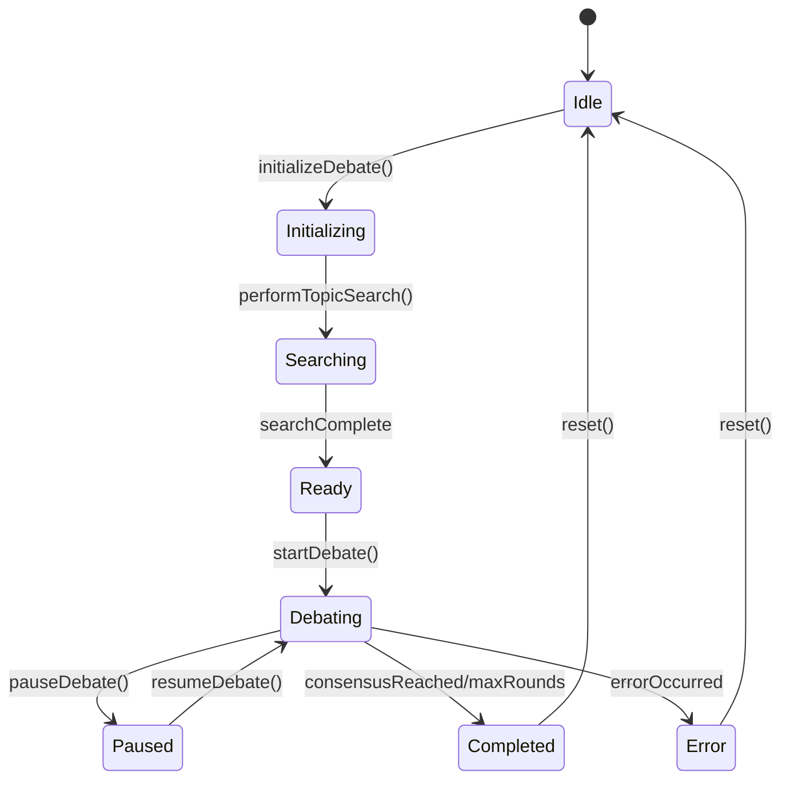
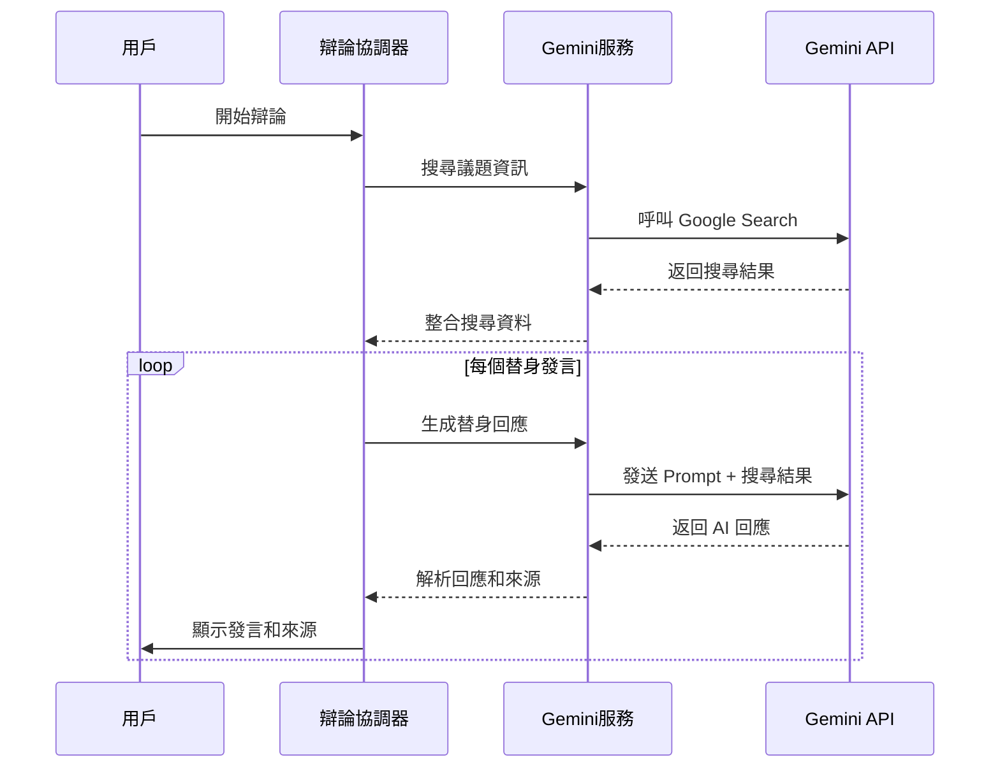
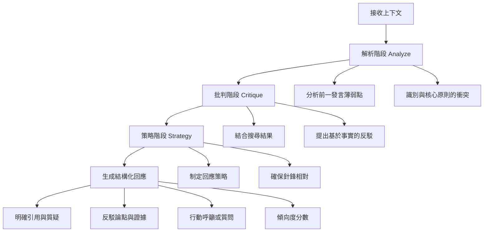
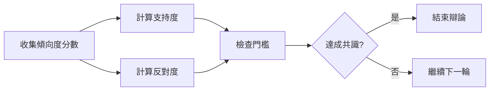
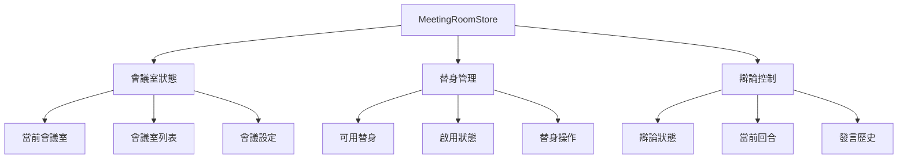
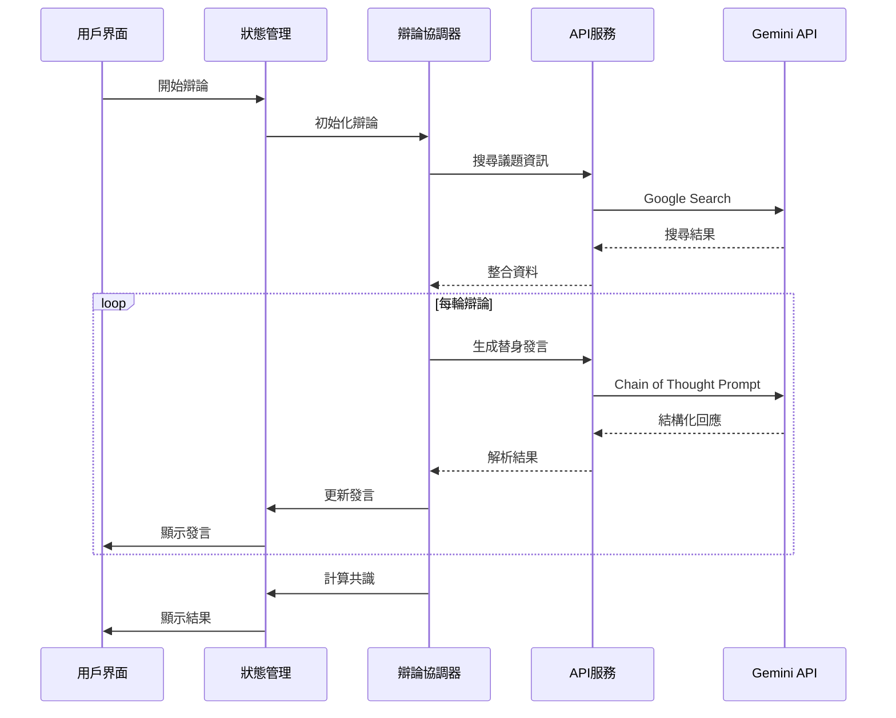

# 虛擬會議室系統設計文件

## 概述

虛擬會議室系統是一個基於 Next.js 和 Gemini AI 的智能辯論平台，採用模組化架構設計，支援多替身深度辯論、聯網搜尋和共識計算功能。

## 系統架構



## 核心模組設計

### 1. 替身引擎（PersonaEngine）

替身引擎負責管理虛擬替身的人格特質和行為模式。



**設計決策：**
- 使用靜態方法設計，避免狀態管理複雜性
- 支援動態 Prompt 生成，確保替身行為一致性
- 內建驗證機制，確保替身配置完整性

### 2. 辯論協調器（DebateOrchestrator）

辯論協調器管理整個辯論流程，包括替身輪替、狀態同步和事件處理。



**關鍵功能：**
- 事件驅動架構，支援狀態變化監聽
- 錯誤處理和重試機制
- 支援暫停/恢復功能
- 自動共識檢測

### 3. Gemini 服務整合



**技術實現：**
- 使用 Gemini 2.0 Flash 模型，支援 Google Search grounding <kreference link="https://ai.google.dev/gemini-api/docs/google-search" index="1">[^1]</kreference>
- 實現來源引用解析和顯示
- 支援批量請求和錯誤重試
- 溫度參數個性化設定

### 4. Chain of Thought 推理機制

基於研究顯示，Chain of Thought 推理能顯著提升 AI 的複雜推理能力 <kreference link="https://www.promptingguide.ai/techniques/cot" index="2">[^2]</kreference>。



**Prompt 範本結構：**
```
【替身身份設定】
身份：{persona.identity}
核心原則：{persona.primeDirective}
辯論風格：{persona.toneStyle}
預設傾向：{persona.defaultBias}

【最新查證資訊】
{searchResults}

【辯論歷史】
{previousStatements}

【內部強制性思考步驟】
1. 解析目標論點 (Analyze)
2. 檢驗與批判 (Critique)  
3. 規劃回應策略 (Strategy)

【強制性輸出結構】
1. 明確引用與質疑
2. 反駁論點與證據
3. 行動呼籲或質問
4. 傾向度分數：[1-10]/10
```

### 5. 共識計算機制



**計算公式：**
- 支持度 = Σ(分數) / (10 × 替身數量)
- 反對度 = Σ(10-分數) / (9 × 替身數量)
- 共識門檻：預設 70%，可調整

### 6. 狀態管理架構

使用 Zustand 進行狀態管理，採用模組化設計：



## 資料流設計

### 辯論流程資料流



## 錯誤處理策略

### 1. API 錯誤處理
- 實現指數退避重試機制
- 設定最大重試次數（3次）
- 提供降級處理方案

### 2. 網路錯誤處理
- 檢測網路連接狀態
- 提供離線模式提示
- 支援手動重試功能

### 3. 資料驗證
- 前端表單驗證
- 後端 API 參數驗證
- 替身配置完整性檢查

## 效能優化

### 1. API 呼叫優化
- 批量處理搜尋請求
- 快取搜尋結果
- 使用適當的模型溫度參數

### 2. 前端效能
- 虛擬滾動處理大量發言
- 懶載入替身組件
- 狀態更新防抖處理

### 3. 記憶體管理
- 限制辯論歷史記錄數量
- 定期清理無用狀態
- 使用 WeakMap 避免記憶體洩漏

## 安全考量

### 1. API 金鑰安全
- 環境變數儲存 API 金鑰
- 伺服器端 API 呼叫
- 避免前端暴露敏感資訊

### 2. 輸入驗證
- 防止 Prompt 注入攻擊
- 限制輸入長度和格式
- 過濾惡意內容

### 3. 資料隱私
- 本地儲存敏感資料
- 不記錄個人識別資訊
- 遵循資料保護法規

  [^1]: https://ai.google.dev/gemini-api/docs/google-search
  [^2]: https://www.promptingguide.ai/techniques/cot